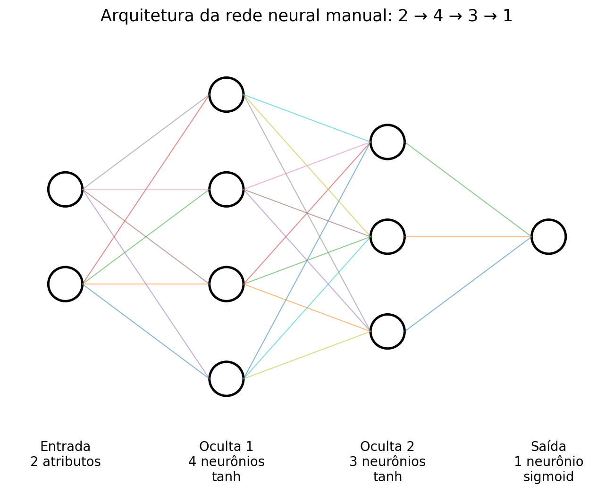
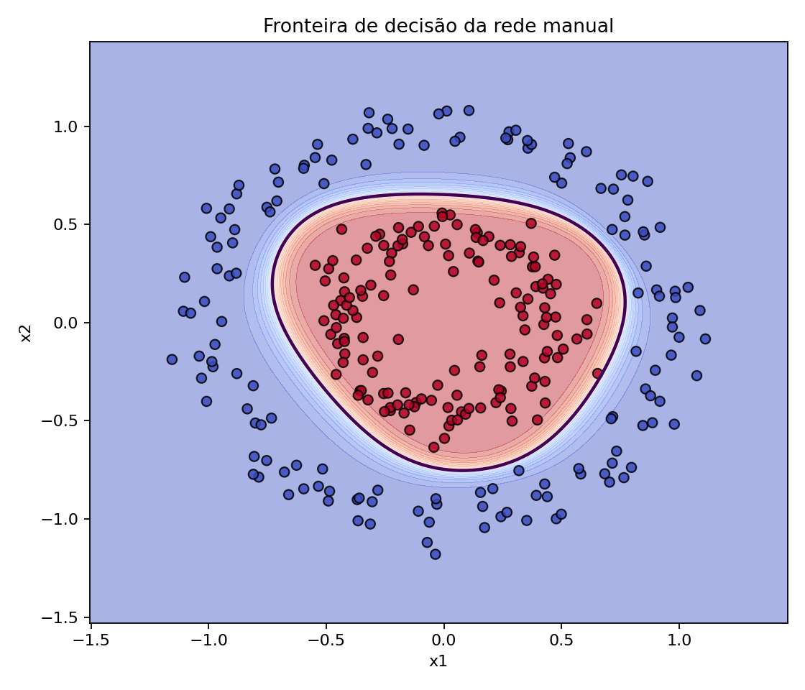

# Rede Neural Manual: Classificação de Círculos Concêntricos

Projeto desenvolvido a partir do `exemplo4.py` da aula de 21/08/2026. O objetivo é modificar a rede apresentada em sala e, principalmente, implementar explicitamente o *forward pass*, o *backpropagation* e a atualização dos pesos sem usar uma biblioteca de redes neurais na implementação principal.

## Modificações realizadas

| Elemento | Exemplo da aula | Este projeto |
|---|---|---|
| Base de dados | `make_moons` | `make_circles` |
| Amostras | 100 | 300 |
| Arquitetura manual | 2 → 2 → 1 | **2 → 4 → 3 → 1** |
| Camadas ocultas | 1 | **2** |
| Ativação oculta | sigmoid | **tanh** |
| Ativação de saída | sigmoid | sigmoid |
| Função de custo | erro quadrático | **entropia cruzada binária** |
| Implementação | hardcoded / NumPy | **hardcoded / NumPy** |
| Comparação | Keras | Keras com a mesma arquitetura |

A base foi mantida pequena de propósito, porque o objetivo é estudar as operações internas da rede, e não desempenho em grande escala.

## Arquitetura



## Resultados

Após executar o projeto, os números exatos ficam registrados em:

```text
resultados/resultados.txt
```



## Como executar

### 1. Criar ambiente virtual

Linux/macOS:

```bash
python -m venv .venv
source .venv/bin/activate
```

Windows:

```powershell
python -m venv .venv
.venv\Scripts\activate
```

### 2. Instalar dependências

```bash
pip install -r requirements.txt
```

### 3. Executar

```bash
python rede_neural_circulos.py
```
