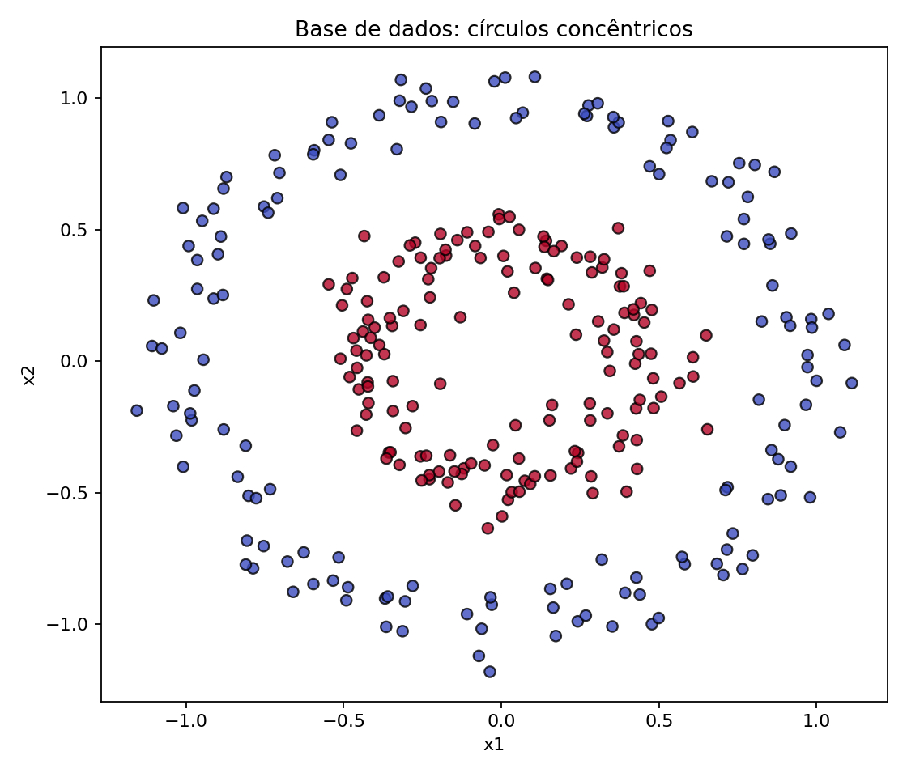
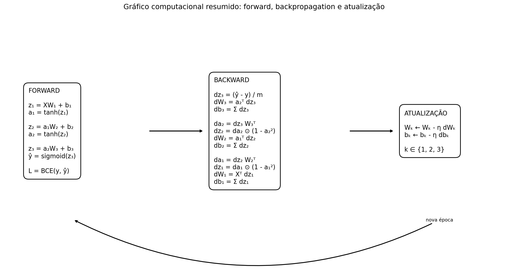

# Rede Neural Manual: Classificação de Círculos Concêntricos

Projeto desenvolvido a partir do `exemplo4.py` da aula de 21/08/2026. O objetivo é modificar a rede apresentada em sala e, principalmente, implementar explicitamente o *forward pass*, o *backpropagation* e a atualização dos pesos sem usar uma biblioteca de redes neurais na implementação principal.

## Modificações realizadas

| Elemento | Exemplo da aula | Este projeto |
|---|---|---|
| Base de dados | `make_moons` | `make_circles` |
| Amostras | 100 | 300 |
| Arquitetura manual | 2 → 2 → 1 | **2 → 4 → 3 → 1** |
| Camadas ocultas | 1 | **2** |
| Ativação oculta | sigmoid | **tanh** |
| Ativação de saída | sigmoid | sigmoid |
| Função de custo | erro quadrático | **entropia cruzada binária** |
| Implementação | hardcoded / NumPy | **hardcoded / NumPy** |
| Comparação | Keras | Keras com a mesma arquitetura |

A base foi mantida pequena de propósito, porque o objetivo é estudar as operações internas da rede, e não desempenho em grande escala.

## Arquitetura


A rede possui:

- duas entradas (`x1`, `x2`);
- primeira camada oculta com 4 neurônios e `tanh`;
- segunda camada oculta com 3 neurônios e `tanh`;
- um neurônio de saída com `sigmoid`.

Em notação matricial:

```text
z1 = X W1 + b1
a1 = tanh(z1)

z2 = a1 W2 + b2
a2 = tanh(z2)

z3 = a2 W3 + b3
y_hat = sigmoid(z3)
```

Dimensões dos parâmetros:

```text
W1: 2 x 4      b1: 1 x 4
W2: 4 x 3      b2: 1 x 3
W3: 3 x 1      b3: 1 x 1
```

## Base de dados



`make_circles` cria duas classes em círculos concêntricos. Esse formato não pode ser separado adequadamente por uma única reta, então a rede precisa aprender uma fronteira de decisão não linear.

O conjunto é dividido de forma estratificada em 75% para treinamento e 25% para teste.

## Funções de ativação

### Tangente hiperbólica

Nas camadas ocultas:

```text
a = tanh(z)
```

Sua derivada, usada explicitamente no backpropagation, é:

```text
da/dz = 1 - a²
```

### Sigmoide

Na saída:

```text
sigmoid(z) = 1 / (1 + exp(-z))
```

Ela transforma a saída em um valor entre 0 e 1, interpretado como probabilidade da classe 1.

## Função de custo

Foi utilizada entropia cruzada binária:

```text
L = -mean[y log(y_hat) + (1-y) log(1-y_hat)]
```

Com `sigmoid` na saída e entropia cruzada binária, a derivada em relação a `z3` simplifica para:

```text
dz3 = (y_hat - y) / m
```

Essa simplificação é uma consequência da regra da cadeia, e não uma derivada fornecida por uma biblioteca.

## Backpropagation manual



A propagação do gradiente é implementada explicitamente no arquivo `rede_neural_circulos.py`.

### Camada de saída

```text
dz3 = (y_hat - y) / m
dW3 = a2.T @ dz3
db3 = sum(dz3)
```

### Segunda camada oculta

```text
da2 = dz3 @ W3.T
dz2 = da2 * (1 - a2²)
dW2 = a1.T @ dz2
db2 = sum(dz2)
```

### Primeira camada oculta

```text
da1 = dz2 @ W2.T
dz1 = da1 * (1 - a1²)
dW1 = X.T @ dz1
db1 = sum(dz1)
```

### Atualização dos parâmetros

Para cada matriz de pesos e vetor de bias:

```text
W = W - learning_rate * dW
b = b - learning_rate * db
```

O treinamento manual usa gradiente descendente em lote completo (*full-batch gradient descent*).

## Verificação do backpropagation

O código inclui um `gradient check` por diferenças finitas. Ele altera ligeiramente alguns parâmetros, calcula numericamente a inclinação da função de custo e compara esse valor com a derivada obtida pelo backpropagation manual.

Essa verificação não é usada para treinar a rede. Ela serve apenas para detectar erros nas derivadas implementadas.

## Resultados

Após executar o projeto, os números exatos ficam registrados em:

```text
resultados/resultados.txt
```

Também são produzidos:

- `resultados/curva_loss.png`
- `resultados/fronteira_decisao.png`


## Comparação com Keras

O mesmo arquivo contém uma segunda implementação usando Keras/TensorFlow, exclusivamente para comparação. A arquitetura é equivalente:

```text
Dense(4, tanh)
Dense(3, tanh)
Dense(1, sigmoid)
```

Ela usa SGD e `binary_crossentropy`, permitindo comparar a implementação manual com uma biblioteca que calcula o gradiente automaticamente.

## Como executar

### 1. Criar ambiente virtual

Linux/macOS:

```bash
python -m venv .venv
source .venv/bin/activate
```

Windows:

```powershell
python -m venv .venv
.venv\Scripts\activate
```

### 2. Instalar dependências

```bash
pip install -r requirements.txt
```

### 3. Executar

```bash
python rede_neural_circulos.py
```

Parâmetros opcionais:

```bash
python rede_neural_circulos.py --epochs 3000 --learning-rate 0.1 --samples 300
```

Para executar apenas a versão manual, sem TensorFlow/Keras:

```bash
python rede_neural_circulos.py --skip-keras
```

## Estrutura do repositório

```text
rede_neural_circulos/
├── rede_neural_circulos.py
├── README.md
├── requirements.txt
├── .gitignore
└── resultados/
    ├── arquitetura.png
    ├── curva_loss.png
    ├── dataset.png
    ├── fronteira_decisao.png
    ├── grafo_computacional.png
    └── resultados.txt
```

## Principais decisões do projeto

1. **`make_circles`** foi escolhido para manter uma base pequena, visual e não linear.
2. **Duas camadas ocultas** tornam a arquitetura diferente da rede da aula e permitem exercitar o backpropagation por mais de uma camada.
3. **`tanh`** foi adotada para que sua derivada apareça explicitamente na implementação manual.
4. **Entropia cruzada binária** foi utilizada por ser apropriada ao problema de classificação binária.
5. **Separação treino/teste** foi adicionada para avaliar se a rede aprendeu uma regra que também funciona em dados não usados diretamente na atualização dos pesos.
6. **Gradient check** foi incluído como validação independente das derivadas manuais.
7. **Keras** é usado somente como referência posterior. A rede principal permanece implementada manualmente em NumPy.
